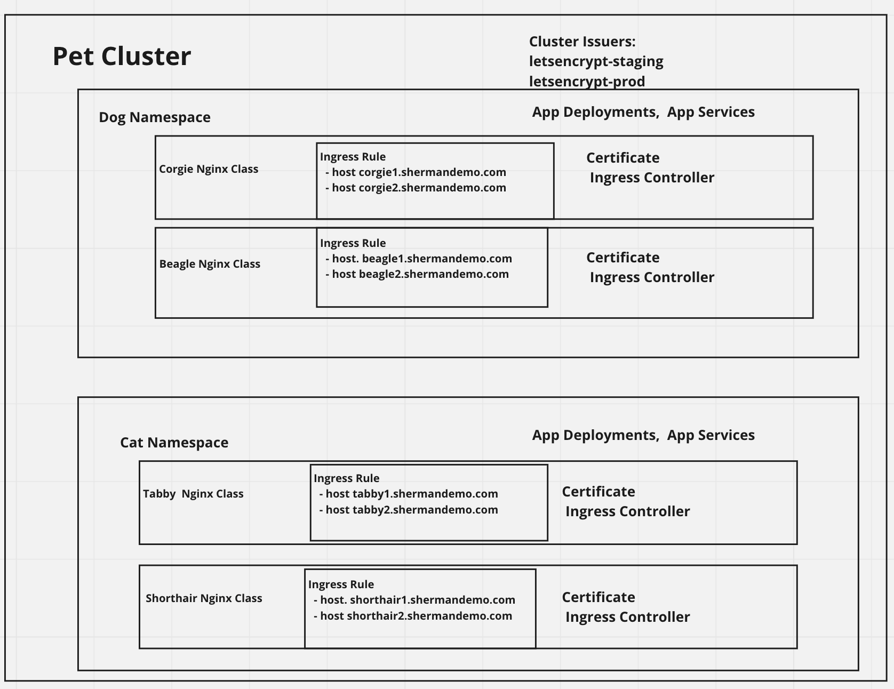

# Setup


### Assumes helm is installed.  Borrowed from https://cert-manager.io/docs/tutorials/acme/ingress/
  * Note: No more tiller needed.

### 1. Installs default hello world deployment and service
```
 kubectl apply -f hello_world_deployment.yaml; kubectl apply -f hello_world_svc.yaml
```

### 2.  This installs the NGINX ingress controller named duncan-quickstart, creates an Ingress class "nginx-duncan"
```
helm install duncan-quickstart-nginx ingress-nginx/ingress-nginx --namespace pets --set rbac.create=true --set controller.ingressClass=nginx-duncan
```
#### 2a.  EDIT:  I've since switched to using the default nginx ingress class and ingress-all.yaml so remove --set controller.ingressClass above and no need for 3.  I do this
```
helm install pets-quickstart-nginx ingress-nginx/ingress-nginx --namespace pets --set rbac.create=true
```

### SKIP
##### 3. This installs a second NGINX ingress controller named max-quickstart, Ingress class "nginx-max"
```
 helm install max-quickstart-nginx ingress-nginx/ingress-nginx --namespace pets --set rbac.create=true --set controller.ingressClass=nginx-max
```

### 4. Install Cert-manager per the above link.  I install the CRD that's commented out there.  It will create the cert-manager namespace and deploy all of the necessary resources.

### 5. You should see something like this.  Of course, your IP and mileage may vary.  Also make sure you are in the "pets" namespace (or whatever namespace you put this in.)
```
16:26 $ kubectl get svc
NAME                                                   TYPE           CLUSTER-IP   EXTERNAL-IP      PORT(S)                      AGE
duncan-quickstart-ingress-nginx-controller             LoadBalancer   <redacted>   <redacted>   80:30701/TCP,443:32320/TCP   4h3m
duncan-quickstart-ingress-nginx-controller-admission   ClusterIP      <redacted>   <none>           443/TCP                      4h3m
max-quickstart-ingress-nginx-controller                LoadBalancer   <redacted>     <redacted>   80:32393/TCP,443:30289/TCP   4h1m
max-quickstart-ingress-nginx-controller-admission      ClusterIP      <redacted>  <none>           443/TCP                      4h1m
```
### 6.  You'll get External IPs for the NGINX ingress controller.  You'll want to.
  - make them static.
  - Create an A record for them in your DNS.

### 7.  Edit ingress-duncan.yaml and ingress-max.yaml and comment out the cert-manager lines, then 
  ```
  $ kubectl apply -f duncan.yaml; kubectl apply -f ingress-max.yaml. 
  ```
  Look at the above link on what they do with initally creating the ingresses.

#### 7a. At this point, the below should work.  Your browser will complain of SSL.  We take care of that below.
    $ curl http://duncan.shermandemo.com    and 
    $ curl http://max.shermandemo.com 
    
### 8.  At this point, I basically follow the above link -> Step 6 - Configure Let’s Encrypt Issuer.  A couple of differences:

- I'm using Cluster Issuers for LetsEncrypt Prod and Staging.  This makes it so that we don't have to keep repeating ourselves per namespace for getting our certs.
- When I go for deploying the TLS resources, I need to specify the ingress class I want to override with.   See  ...acme.cert-manager.io/http01-ingress-class for examples.

### 9.  Again, go through the link and examples.  You want to make sure that you can create the certificate on staging first, then on production (letsencrypt).

   At this point, I am able to get to https://duncan.shermandemo.com and https://max.shermandemo.com

### 10. At this point, I was able to dupliate tls hosts and rules (per said host) under the ingress-max.yaml and made a mindy.shermandemo.com domain.  After applying DNS settings, 
```
$ kubectl apply -f ingress-max.yaml
$ <then delete the secret>, in this case I did kubectl delete secret max-quickstart-tls
```

Then...
```
$ kubectl get certificates (your time should be in seconds)

NAME                    READY   SECRET                  AGE
duncan-quickstart-tls   True    duncan-quickstart-tls   118m
max-quickstart-tls      True    max-quickstart-tls      47m

$ kubectl describe cert max-quickstart-tls
...
 Normal  Issuing    42m (x3 over 48m)  cert-manager  The certificate has been successfully issued


$ kubectl get ingress 
duncan-ingress   <none>   duncan.shermandemo.com                      <redacted>  80, 443   122m
max-ingress      <none>   max.shermandemo.com,mindy.shermandemo.com   <redacted>   80, 443   117m
```

Now in your browser, get "hello world" Nirvana:
- https://duncan.shermandemo.com
- https://max.shermandemo.com
- https://mindy.shermandemo.com


### TROUBLESHOOTING:  You can look at the challenge and order Kubernetes Resources.


